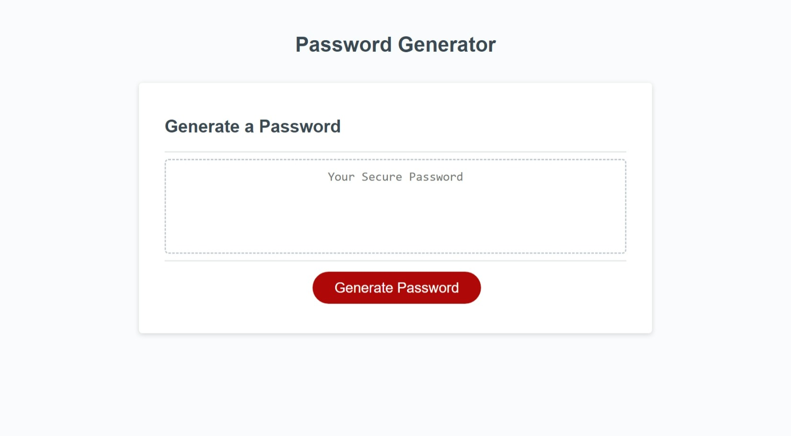

# Password Generator

## Description

This webpage is a password generator application. You can generate a random 
password by selecting the desired criteria.

## Usage

When you click on "Generate Password" red button, you are prompted to enter the length of the password. Once you select the length then you can select 
either to include lowercase, uppercase, numeric or special characters. You have to choose atleast one type of characters. After selecting the criteria,
the password appears on the webpage in place of the placeholder "your secure 
password".

## Credits

MDN web docs helped me understand different concepts to build this webpage.

## License

MIT License

## Project URL

URL link to the Password Generator webpage:
(https://saritha2708.github.io/password-generator/).

## Project image

The following image shows the display of the webpage:

